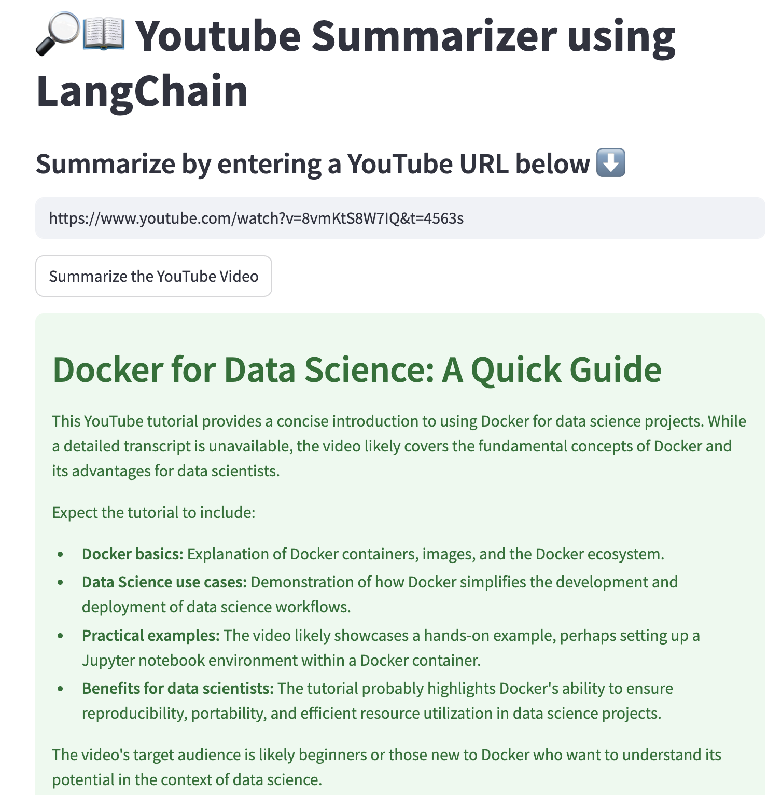

# 🔎📖 YouTube Summarizer using LangChain & Groq (Gemma Model)

Summarize YouTube videos in seconds using LangChain and Groq's Gemma model! Enter any YouTube URL, and this Streamlit app will fetch its transcript, process it through LLM, and generate a clean, concise 300-word summary along with the video title.

---

## 📸 Demo Screenshot

<p align="center">
  
</p>

---

## 🚀 Features
- Summarize YouTube videos into 300 words.
- Uses Groq's **Gemma2-9b-it** model via LangChain.
- Fetches transcript and video metadata automatically.
- Interactive Streamlit interface.
- Ideal for quick reviews, study notes, or research.

## 🛠️ Requirements

```bash
pip install -r requirements.txt
```

## 🌐 How to Run

1. Clone this repository:
    ```bash
    git clone https://github.com/StagMindVRithul/YT_Summarizer.git
    cd YT_Summarizer
    ```

2. Install dependencies:
    ```bash
    pip install -r requirements.txt
    ```

3. Run the app:
    ```bash
    streamlit run app.py
    ```

## 🔑 Get Your GROQ API Key
- Sign up at [Groq Cloud](https://console.groq.com/keys) and grab your API key.

## 📄 Example
1. Enter your **GROQ API Key** in the sidebar.
2. Paste a valid **YouTube URL**.
3. Click "**Summarize the YouTube Video**" and get the summarized content!

## 📦 Tech Stack
- **Streamlit** for UI
- **LangChain** for chain management
- **Groq Gemma Model** for LLM
- **YouTube Transcript API** & **yt_dlp** for data fetching

---

## 🛡️ License

This project is licensed under the [MIT License](LICENSE). Feel free to use, modify, and share with attribution.

---
## 📢 Connect with Me

Let's collaborate! Connect with me on:

[](https://www.linkedin.com/in/v-rithul-06b5632b6/)  

🚀 **Happy Coding!**
